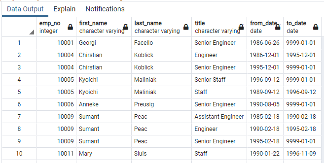
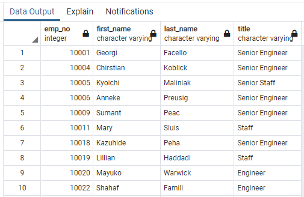
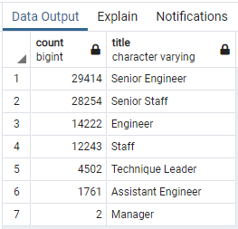
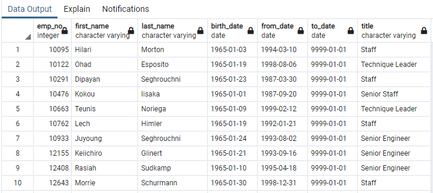

# Pewlett-Hackard-Analysis

## I. Overview of Project

### Background
Pewlett_hackard is looking ahead and preparing itself for the silver tsunami. Using SQL, Bobby was able to provide them with valuable data with who and how many will be retiring in the next few years. 

### Objective
Now hi manager wants him to determine the number of retiring employees per title, and identify employees who are eligible to participate in a mentorship program.

## II. Results

## III. Summary
