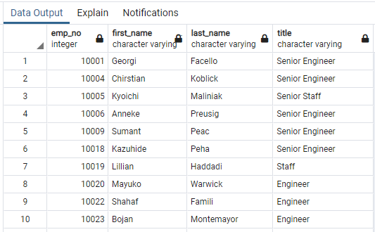

# Pewlett-Hackard-Analysis

## I. Overview of Project

### Background
Pewlett_hackard is looking ahead and preparing itself for the silver tsunami. Using SQL, Bobby was able to provide them with valuable data with who and how many will be retiring in the next few years. 

### Objective
Now, his manager wants him to determine the number of retiring employees per title, and identify employees who are eligible to participate in a mentorship program.

## II. [Analysis and Results](Queries/Employee_Database_challenge.sql)

### A. Retirement Titles
First, the employees' data were filtered by their birth_date. With this, we will know who are retiring or about to retire within the next few years and what title they hold. 

The table above had **133,776 results**, but this doesn't mean we have that many retirees. A lot of these people who have worked so long with the company had duplicate entries because they have held many titles over the years.

### B. Unique Titles

After excluding those that have already left and filtering using distinct employee numbers, we finally got the number of **72,458 unique employees** with their most recent title:

### C. Retiring Titles

A breakdown of these employees by title:

The majority **(70%)** of them are **senior engineers/ senior staff.**

### D. Mentorship Eligibility

Filtering the current employees based on those who were born in the year 1965, a mentorship-eligibility table was created below:

There were a total of **1,549 employees eligible for the mentorship program.**

## III. Summary

In summary, there will be **72,458 employees that will retire in the next 3 years**. This is actually **30% of the current employees** of the entire company and will be ver problematic. As the "silver tsunami" begins to make an impact, **16,981 roles need to be filled up in the first year alone.**

Pewlett-Packard aims to use employees that are **getting ready to retire (born:1965/Age:57)** as mentors for their newly hired employees. That means that on the 1st year, only 1,549 employees will be available to mentor 16,981 newly hired employees that will replace the retirees. 

